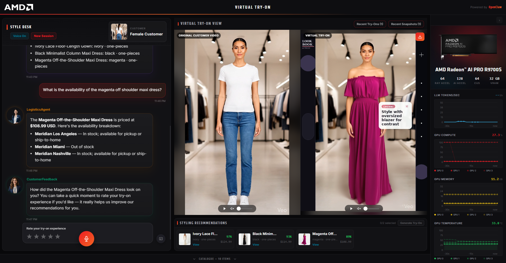
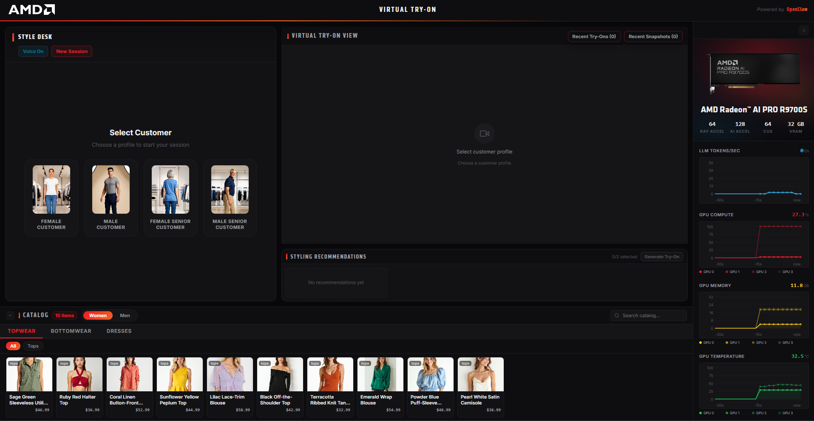
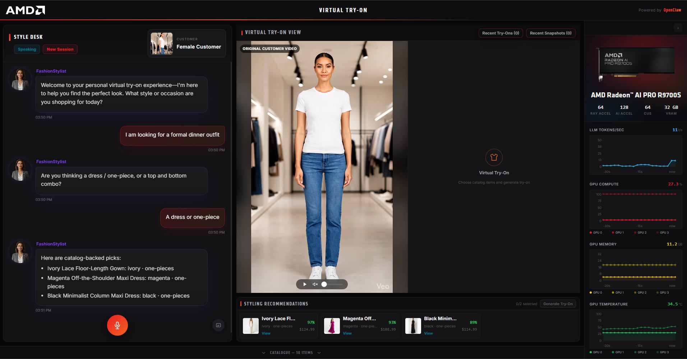
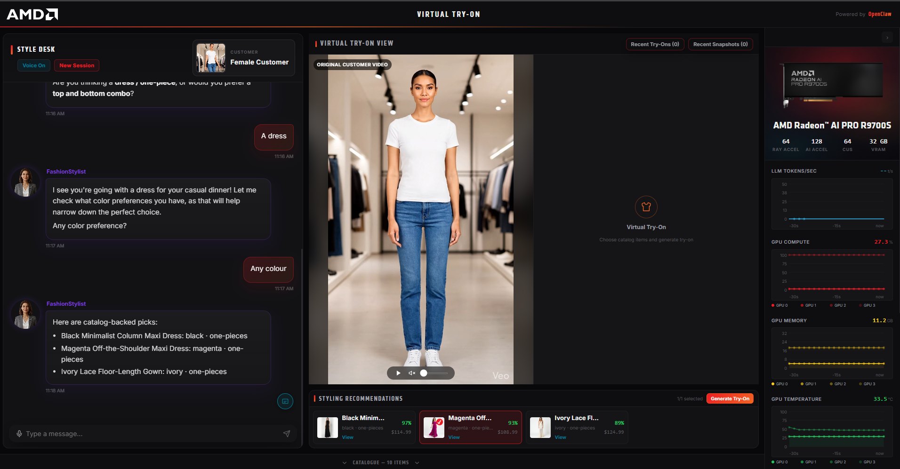
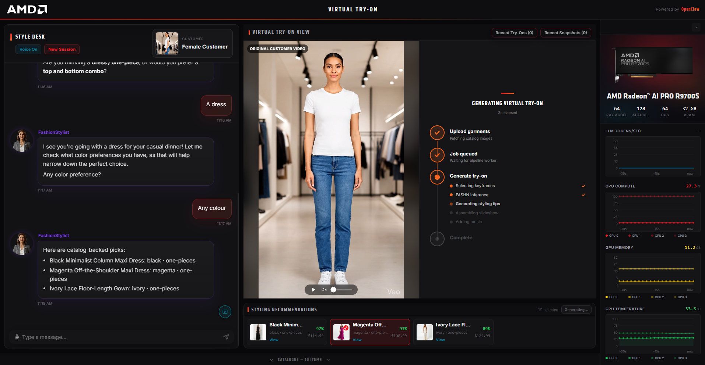
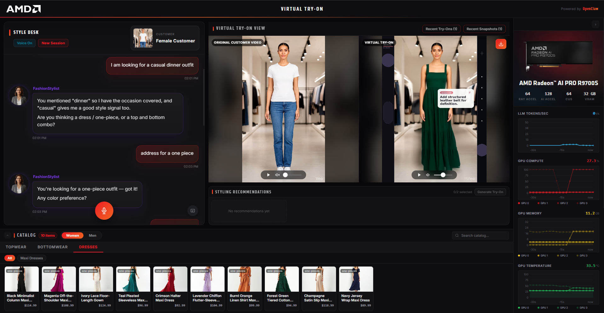
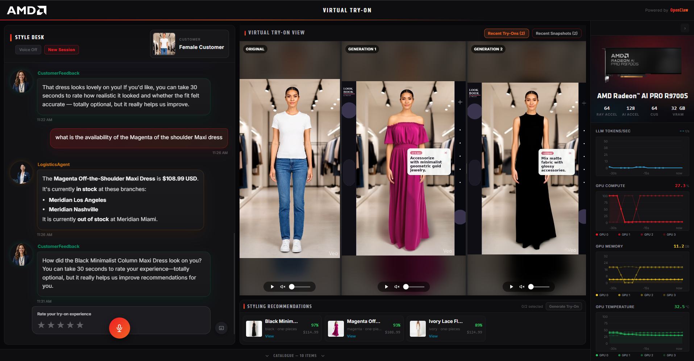
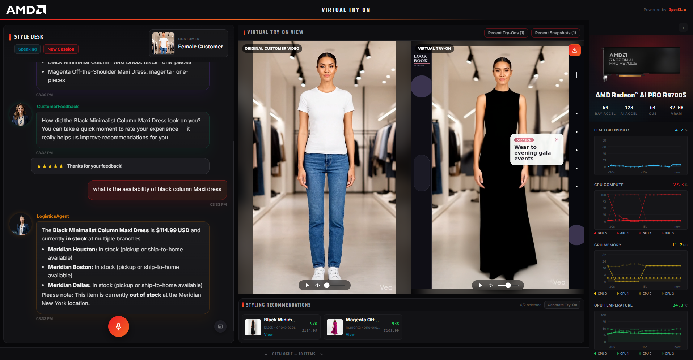
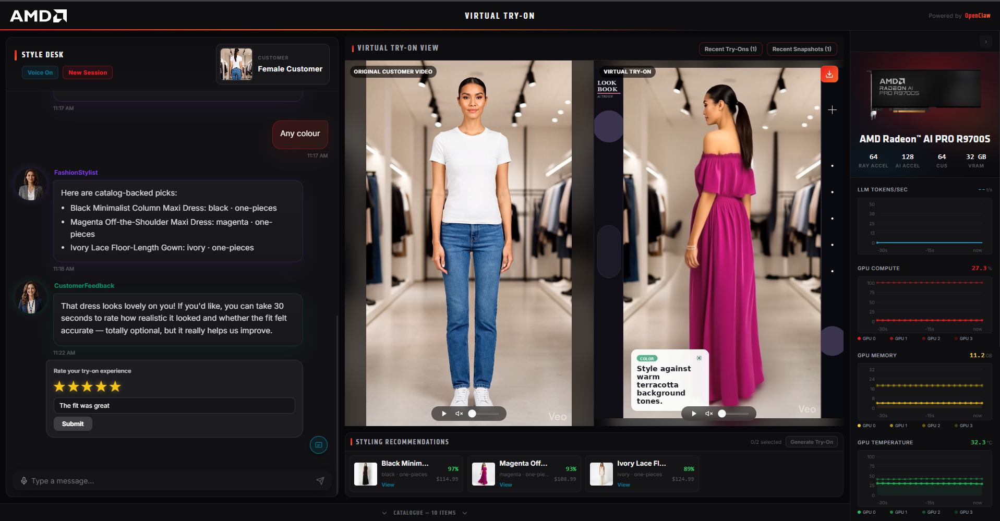

<!--
Copyright Advanced Micro Devices, Inc.

SPDX-License-Identifier: MIT
-->

# Virtual Try-On

**On-Premise GenAI Solution for On-Demand Garment Try-On and AI-Powered Style Discovery**

*Built for retail deployments on 4-GPU AMD Radeon AI PRO R9700S hardware with the AMD ROCm 7.2.3 stack.*

<div align="center">
  
  <p><em>Main dashboard overview</em></p>
</div>

---

## Table of Contents

- [Introduction](#introduction)
- [Key Features](#key-features)
- [Prerequisites](#prerequisites)
- [Deploying the Solution](#deploying-the-solution)
- [User Interface and Flow](#user-interface-and-flow)
- [Operations](#operations)
- [Advanced Configuration](#advanced-configuration)
- [Known Issues](#known-issues)
- [Documentation](#documentation)
- [Disclaimer](#disclaimer)

---

## Introduction

Shoppers browsing a physical or digital storefront want to see how a garment looks on them before committing. This solution delivers a **unified, on-premise virtual try-on platform** that composites selected garments onto a customer video using FASHN diffusion inference and returns a styled try-on slideshow, while a multi-agent AI layer — built on OpenClaw and powered by a local Qwen LLM — drives personalised style discovery, logistics-enriched recommendations, and customer feedback collection.

---

## Key Features

| Feature | Description |
| ------- | ----------- |
| **Privacy-Preserving On-Prem AI Infrastructure** | All AI workloads run locally on 4× AMD Radeon AI PRO R9700S GPUs, keeping customer videos, images, and shopping interactions within the retailer's infrastructure while delivering high-performance inference without external data processing. |
| **Diffusion-Powered Virtual Try-On** | Dual FASHN inference servers generate photo-realistic garment composites from customer demo videos; DWPose-powered frame selection extracts the sharpest, most pose-diverse keyframes (front, back, side) to maximise showcase quality |
| **AI-Styled Slideshow with Dynamic Music** | Selected keyframes are stitched into a crossfade slideshow with LLM-written styling-tip text overlays and ACE-Step AI-generated background music, producing a polished, shareable try-on video |
| **Voice-First Agentic Shopping** | The Style Desk is voice-first — a microphone button captures speech via the Web Speech API and Kokoro TTS reads agent replies aloud; OpenClaw agents (Qwen 3.6 27B) drive preference discovery, logistics enrichment, and feedback collection |
| **Gender-Scoped Catalogue with AI-Powered Discovery** | One of four customer profiles scopes the catalogue and agent recommendations by gender; BGE text embeddings and DINOv3 visual similarity search via Milvus enable natural-language and image-based discovery; every recommendation card shows live branch stock, pricing, and fulfilment status |
| **Session History and Comparison** | All generations in a session are preserved; the try-on panel shows the original customer video alongside the latest result and lets shoppers step through or compare multiple attempts side by side |

---

## Prerequisites

This solution was deployed and tested on the following hardware:

**Hardware**

| Component | Specification |
| --------- | ------------- |
| **CPU** |  AMD Ryzen Threadripper PRO 9995WX 96-Cores  |
| **GPU** | 4× AMD Radeon AI PRO R9700S (32 GB VRAM each, gfx1201) |
| **System RAM** | 256 GB DDR5 |
| **Storage** | 500 GB free NVMe SSD (Docker images, model weights, generated videos) |

**Software**

| Component | Version |
| --------- | ------- |
| **Operating System** | Ubuntu 24.04 LTS |
| **Linux Kernel** | 6.17.0-29-generic |
| **Docker Engine** | 25.0+ |
| **Docker Compose** | v2.20+ |
| **ROCm** | 7.2.3 |

> **4 GPUs are required.** 

**Internet connection**

An internet connection is required for the first build and boot. The following assets are pulled from the internet (sizes are approximate — verify against your environment):

| Asset | Size | When |
| ----- | ---- | ---- |
| Docker base images (ROCm, FASHN, etc.) | ~30 GB | First `docker compose build` |
| ACE-Step music generation model | ~5 GB | Pre-downloaded to the host before setup (see step 3) |
| Ollama `qwen3.6:27b` LLM weights | ~15 GB | First agent interaction |
| Lemonade Kokoro TTS model | ~500 MB | First TTS request |

After the initial download, all assets are served locally and no internet access is required for day-to-day operation.

> [!IMPORTANT]
> **A Hugging Face token is required.** Visual search uses Meta's **[DINOv3](https://huggingface.co/facebook/dinov3-vits16-pretrain-lvd1689m)**, a **gated model**. While signed in, accept its license on the model page, then create a read token at <https://huggingface.co/settings/tokens> and supply it when `setup.sh` prompts (`HF_TOKEN`). 

---

## Deploying the Solution

### 1. Clone the repository

```bash
git clone <repository-url>
cd retail-virtual-tryon
```

---

### 2. Verify ROCm and GPU visibility

```bash
rocm-smi
```

Confirm all 4 GPUs appear before proceeding.

---

### 3. Start the stack

The recommended path is the guided `setup.sh` script. It checks all prerequisites, writes and validates `.env` (including secrets), builds all service images, starts every container, and seeds the garment catalogue:

```bash
./scripts/setup.sh
```

If `.env` is already configured and you only need to rebuild and launch:

```bash
docker compose up -d --build
```

Either path brings up:

- **Infrastructure**: TimescaleDB (PostgreSQL 16), Valkey, etcd, RustFS, Milvus
- **Metrics**: AMD device metrics exporter, node-exporter, Prometheus, Ollama metrics proxy
- **AI services**: FASHN server 0 (GPU 0), FASHN server 1 (GPU 1), Ollama (GPU 2), ACE-Step (GPU 3), Lemonade TTS (CPU)
- **Application**: FastMCP tool server, FastAPI backend, OpenClaw gateway, React frontend, fashion pipeline API

> **First boot** can take **10–20 minutes** while GPU images build and model weights load. Monitor with `docker compose ps`.

---

### 4. Verify deployment

```bash
docker compose ps

# Frontend health (only externally exposed port)
curl http://localhost:5173/health

```

---

### 5. Access the application

Use one of the following based on where the stack is running:

<ol>
  <li>
    <strong>Local deployment (same workstation)</strong>
    <ol type="a">
      <li>No port forwarding required.</li>
      <li>Open <a href="http://localhost:5173">http://localhost:5173</a>.</li>
    </ol>
  </li>
   <li>
    <strong>Remote server deployment (access over SSH)</strong>
    <p>Forward port <code>5173</code> to your local machine.</p>
    <ol type="i">
      <li>
        <strong>VS Code Ports panel</strong>
        <ol type="a">
          <li>Open the Command Palette (<code>Ctrl+Shift+P</code> / <code>Cmd+Shift+P</code>).</li>
          <li>Select <strong>Forward a Port</strong>.</li>
          <li>Add <code>5173</code>.</li>
          <li>Open <a href="http://localhost:5173">http://localhost:5173</a> locally.</li>
        </ol>
      </li>
      <li>
        <strong>SSH local port forwarding</strong>
        <ol type="a">
          <li>Run:<pre><code>ssh -L 5173:localhost:5173 &lt;user&gt;@&lt;remote_host&gt;</code></pre></li>
          <li>Open <a href="http://localhost:5173">http://localhost:5173</a> locally.</li>
        </ol>
      </li>
    </ol>
  </li>
</ol>

> **Note:** On first agent interaction, Ollama pulls `qwen3.6:27b` (~15 GB). On first TTS request, Lemonade pulls the Kokoro model (~500 MB). Both are cached to the host directories configured in `.env`.

---

## User Interface and Flow

Open [http://localhost:5173](http://localhost:5173). No sign-in required — the dashboard loads straight into the try-on view.

<div align="center">
  
  <p><em>Main dashboard overview</em></p>
</div>

### 1. Select a Customer Profile

The **Style Desk** panel opens with a customer selector offering four profiles, each with a short preview video:

- **Female Customer** / **Female Senior Customer** — scope the catalogue and all agent recommendations to women's garments.
- **Male Customer** / **Male Senior Customer** — scope to men's garments.

Once selected, the FashionStylistAgent greets the shopper and asks about their style goals. The customer video thumbnail appears in the Style Desk header for the rest of the session.

<div align="center">
  
  <p><em>Customer profile selection screen</em></p>
</div>

---

### 2. Chat with the Fashion Stylist — voice first

Use the microphone button to speak or the pencil icon to type. Agent responses appear as text and can be spoken aloud. The **Voice On/Off** toggle lets you enable or mute audio responses at any time.


Example prompts to get started:

- *"I need something formal for a dinner."*

- *"I am looking for a wedding guest outfit"*

<div align="center">
  
  <p><em>Voice-first chat with the Fashion Stylist Agent</em></p>
</div>

---

### 3. Select garments to try on

Garments can be added to the try-on in two ways:

**From agent recommendations** — when the FashionStylistAgent replies with outfit suggestions, the cards appear in the **Styling Panel** carousel at the bottom of the screen. Click a card to select it.

**From the Catalogue Browser** — click the catalogue bar at the very bottom to expand it. Switch between the **Women** and **Men** tabs, then browse by category (Topwear, Bottomwear, Dresses, etc.) or use the search filter. Click any garment card to select it.

The Styling Panel header shows a **selection counter** (e.g., `1/2 selected`). Rules:

- Up to **2 separate pieces** (a top + a bottom) can be staged together.
- Selecting a **one-piece** (dress, jumpsuit, etc.) replaces any separates already chosen.
- Selecting a new one-piece replaces the previous one.

<div align="center">
  
  <p><em>Garment selection via agent recommendations and catalogue browser</em></p>
</div>

---

### 4. Generate the try-on

Once at least one garment is selected, the **Generate Try-On** button in the Styling Panel becomes active. Click it to start the pipeline.

The **Try-On Panel** (right side of the screen) shows a live progress breakdown. 

Generation typically takes **40-100 seconds** depending on queue depth and the number of keyframes configured.

<div align="center">
  
  <p><em>Live generation progress in the Try-On Panel</em></p>
</div>

---

### 5. Review and download

When generation completes, the Try-On Panel shows a **side-by-side comparison**:

- **Left** — original customer demo video (loops)
- **Right** — generated try-on slideshow with music

Both panes have play/pause and volume controls. A **Download** button (top-right of the try-on pane) saves the MP4.

<div align="center">
  
  <p><em>Side-by-side comparison with history navigation</em></p>
</div>

Generate multiple try-ons in a session and use the **navigation arrows** to browse them. The **Recent Try-Ons** button opens a history of all generations. Select items to launch **Generations Compare**, where the original video and selected try-ons can be viewed side-by-side.

<div align="center">
  
  <p><em>Multi-generation side-by-side comparison</em></p>
</div>


The **Recent Snapshots** button opens a history of session snapshots. Select a snapshot to view it in a larger preview and download the image.

---

### 6. Check branch availability and pricing

Ask the **Logistics Agent** about any garment at any point in the conversation:

- *"What is the price at the Austin branch?"*
- *"Which locations have this in stock?"*

The agent returns branch-level stock status, display price, and fulfilment options.

<div align="center">
  
  <p><em>Branch availability and pricing lookup</em></p>
</div>

---

### 7. Rate the try-on

After each generation, the **CustomerFeedbackAgent** prompts for feedback using an **inline star-rating widget**.

<div align="center">
  
  <p><em>Inline star-rating feedback widget</em></p>
</div>

---

### 8. Start a new session

Click **New Session** to start fresh, clearing the conversation and selected garments. A new session is created, and the customer profile selector reappears for the next shopper.

---

## Operations

### Logs

```bash
docker compose logs -f                # all services
docker compose logs -f vto-api        # FastAPI backend
docker compose logs -f openclaw       # agent gateway
docker compose logs -f vto-tts        # Lemonade TTS
docker compose logs -f pipeline       # fashion pipeline
```

### Stopping

```bash
docker compose down -v                # stop and remove volumes (destroys all data)
```

---

## Advanced Configuration

Full reference of every variable understood by the stack:

| Variable | Default | Required | Description |
| -------- | ------- | -------- | ----------- |
| `POSTGRES_PASSWORD` | generated by setup | Yes | TimescaleDB password |
| `DATABASE_URL` | set by setup | Yes | Full asyncpg connection string used by `vto-api` and `vto-mcp` |
| `RUSTFS_ACCESS_KEY` | — | Yes | RustFS / Milvus object store access key |
| `RUSTFS_SECRET_KEY` | — | Yes | RustFS / Milvus object store secret key |
| `HF_CACHE_DIR` | — | Yes | Host path bind-mounted as the HuggingFace model cache |
| `OLLAMA_DATA_DIR` | — | Yes | Host path bind-mounted as the Ollama model store |
| `ACESTEP_BUILD_CONTEXT` | `virtual_tryon/fashion-pipeline` | No | Path to the directory containing `acestep.Dockerfile`; set automatically by `setup.sh` |
| `ACESTEP_CACHE_DIR` | `~/.cache/acestep` | No | Host path bind-mounted as the ACE-Step model cache; created and set automatically by `setup.sh` |
| `OPENCLAW_GATEWAY_TOKEN` | `vto-dev-token` | Yes | Auth token for the OpenClaw gateway |
| `ACESTEP_API_KEY` | `fashion-dev-token` | Yes | Auth token for the ACE-Step API |
| `OLLAMA_BASE_URL` | `http://ollama-metrics:8080` | No | Ollama endpoint used by `vto-api` and `openclaw` (routed via metrics proxy) |
| `OLLAMA_API_KEY` | auto-generated by `setup.sh` | No | Auth marker for Ollama (no auth enforced locally; a unique token is minted by `setup.sh` so the value is never left blank) |
| `OLLAMA_MODEL` | `qwen3.6:27b` | No | Model tag served by Ollama (used by the OpenClaw gateway) |
| `OLLAMA_LLM_MODEL` | `qwen3.6:27b` | No | Model tag `vto-api` requests from Ollama for inline preference replies |
| `OPENCLAW_LLM_PROVIDER` | `ollama` | No | OpenClaw model provider |
| `OPENCLAW_LLM_MODEL` | `qwen3.6:27b` | No | Model used by OpenClaw agents |
| `OPENCLAW_BACKEND_MODEL` | — | No | Optional model override sent as `x-openclaw-model` header |
| `OPENCLAW_GATEWAY_TIMEOUT` | `300` | No | OpenClaw request timeout in seconds |
| `OPENCLAW_MAX_COMPLETION_TOKENS` | `1024` | No | Max tokens per agent completion |
| `OPENCLAW_STREAM_TIMEOUT` | `50` | No | Max response time for streaming agent chat (seconds); once hit, deterministic catalog fallback is served |
| `OPENCLAW_MAX_TURNS` | `5` | No | Max conversation turns forwarded to OpenClaw |
| `VTO_CATALOG_FALLBACK_LIMIT` | `20` | No | Max garments to list when catalog search finds no semantic matches |
| `OPENCLAW_INTENT_TIMEOUT` | `10` | No | Timeout for the LLM intent-extraction pre-flight call (seconds); on timeout, rule-based heuristics are used |
| `LLM_API_BASE` | `http://ollama-metrics:8080/v1` | No | LLM endpoint for the fashion pipeline |
| `LLM_MODEL` | `qwen3.6:27b` | No | Model used by the fashion pipeline for fashion tips |
| `FASHN_SERVER_URLS` | `http://fashn0:7860,http://fashn1:7861` | No | Comma-separated FASHN server endpoints |
| `NUM_FRAMES` | `4` | No | Try-on keyframes generated per job |
| `CANDIDATE_FRAMES` | `12` | No | Candidate frames evaluated by `frame_selector.py` |
| `FRAME_DURATION` | `2.5` | No | Duration (seconds) of each keyframe in the slideshow |
| `TIMESTEPS` | `8` | No | FASHN diffusion timesteps (higher = quality, slower) |
| `SEED` | `42` | No | Generation seed for reproducibility |
| `SKIP_MUSIC` | `0` | No | Set `1` to skip ACE-Step music generation |
| `MUSIC_PROMPT` | — | No | Custom ACE-Step music prompt (leave empty for auto) |
| `INPUT_DIR` | `./catalogue` | No | Host path for garment images (bind-mounted read-only) |
| `DEMO_VIDEOS_DIR` | `./virtual_tryon/fashion-pipeline/demo-videos` | No | Host path for demo try-on videos |
| `OUTPUT_DIR` | `./virtual_tryon/fashion-pipeline/output` | No | Host path for generated slideshow videos |
| `VTO_TTS_MODEL` | `kokoro-v1` | No | Lemonade TTS model |
| `VTO_TTS_VOICE` | `af_bella` | No | Kokoro voice ID |
| `VTO_TTS_TIMEOUT` | `300` | No | TTS request timeout in seconds |
| `HSA_OVERRIDE_GFX_VERSION` | `12.0.1` | Yes | Required for gfx1201 (Radeon AI PRO R9700S) |
| `ROCR_VISIBLE_DEVICES` | `0,1,2,3` | Yes | ROCm device mask — always all 4 GPUs |
| `VIDEO_GID` | `44` | No | GPU device group GID for `/dev/dri` access; auto-detected by `setup.sh` |
| `RENDER_GID` | `109` | No | GPU device group GID for `/dev/kfd` access; auto-detected by `setup.sh` |

---

## Known Issues

### Application

- **First agent interaction is slow** — Ollama pulls `qwen3.6:27b` (~15 GB) on first call if the model is not already in `OLLAMA_DATA_DIR`. Subsequent calls load from the local cache.
- **First TTS request is slow** — Lemonade downloads the Kokoro model (~500 MB) on first use.
- **ACE-Step cold-start** — the `acestep` container has a 5-minute startup window while the model loads into GPU 3 memory. The health probe retries for 10 × 30 s before reporting unhealthy.
- **First pipeline generation is slow** — the first try-on generation after stack startup typically takes 3–4 minutes as the FASHN diffusion models are loaded into GPU memory for the first time. 
  
---

## Documentation

| Document | Description |
| -------- | ----------- |
| **[Design](docs/design.md)** | Architecture, agent diagrams, data flow, GPU layout, schemas, ports, and environment variables |

---

## Disclaimer

### Performance

Performance varies by hardware and software configurations, including testing conditions, system settings, application complexity, data volume, software versions, libraries used, and other factors. Any performance or benchmarking results referenced in this repository are provided for informational purposes only and should not be interpreted as a guarantee of actual performance.

### Outcome

This solution is provided as a technology demonstration and has been validated against the sample garment images in `catalogue/` and the demo videos in `virtual_tryon/fashion-pipeline/demo-videos/`. These bundled assets represent the scene types, poses, garment categories, and lighting conditions for which the pipeline has been evaluated and tuned. The FASHN diffusion model and DWPose keyframe selector have known accuracy limitations, particularly with occluded or non-standard poses, fast-moving subjects, low-contrast footage, or inputs that differ from the provided samples. Generated outputs may exhibit garment misalignment, visual artefacts, or failed composites, and should be considered indicative rather than production-ready. No validation or moderation mechanisms are included for user-supplied inputs, and output quality cannot be guaranteed outside the intended demonstration scope.

The garment images, demo videos, and catalogue metadata — including store name, branch locations, pricing, and stock figures — are AI-generated and fictional, intended solely for demonstration and testing purposes. They do not represent any real retailer, product, or inventory system and should not be relied upon for commercial, operational, or real-world retail decision-making. All provided files are supplied "as-is" without warranties. The creators are not responsible for any outcomes resulting from use of these materials outside their intended demonstration context.
