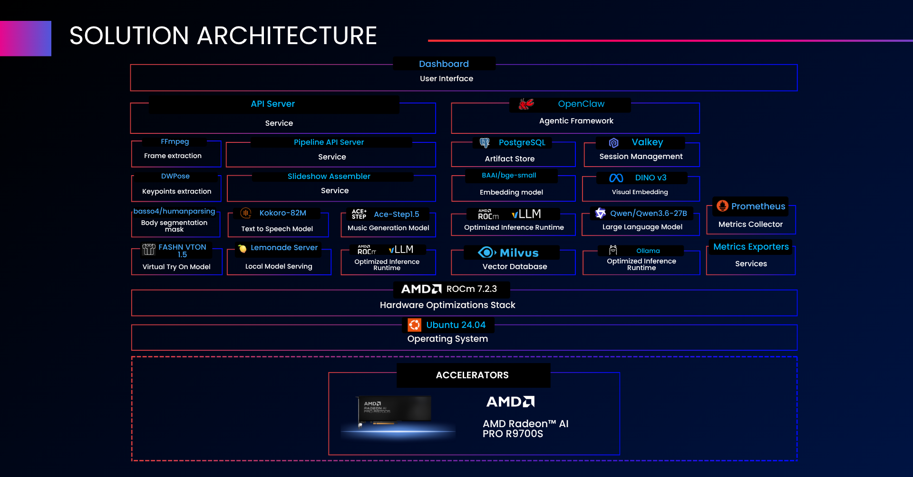
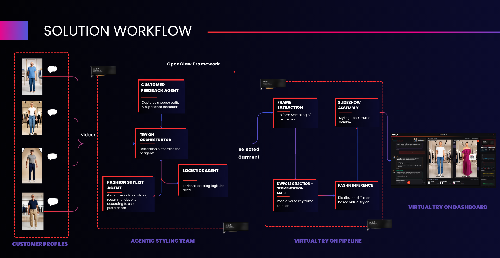

<!--
Copyright Advanced Micro Devices, Inc.

SPDX-License-Identifier: MIT
-->

## Solution Architecture

  
  
<em>Layered solution stack — accelerators → ROCm → frameworks → models → services → dashboard</em>

### Component Glossary

| Layer | Component | Role |
|-------|-----------|------|
| **User Interface** | **Dashboard** | React + TypeScript SPA served by Nginx; garment catalogue browser, agent chat, styling panel, try-on panel, and live GPU metrics sidebar |
| **Application Services** | **VTO API** | FastAPI service exposing REST endpoints for catalogue, search, agent chat proxy, styling recommendations, runtime context, try-on history, and TTS proxy |
| | **VTO MCP Tool Server** | FastMCP Streamable-HTTP server exposing structured catalog, logistics, and event tools to OpenClaw agents |
| | **Fashion Pipeline API** | FastAPI service wrapping the FASHN try-on pipeline — accepts jobs, dispatches to FASHN inference servers, assembles slideshow with music |
| | **OpenClaw Gateway** | OpenClaw agent runtime hosting TryOnOrchestrator, FashionStylistAgent, LogisticsAgent, and CustomerFeedbackAgent; exposes SSE gateway on port 5789 |
| | **PostgreSQL + TimescaleDB** | Relational store for garment catalogue, branch inventory, runtime sessions, try-on history, and customer feedback |
| | **Valkey (Redis-compatible)** | Hot runtime/session state and event pub/sub; keys namespaced by session with a 30-minute TTL |
| **AI Models** | **FASHN Virtual Try-On** | Diffusion-based garment warping model; runs on GPU 0 and GPU 1; accepts person video frame + garment PNG, produces warped keyframe |
| | **Qwen 3.6 27B** | Local LLM served by Ollama (GPU 2) for all OpenClaw agent reasoning — preference discovery, styling recommendations, logistics summaries, and feedback collection |
| | **Kokoro v1 (TTS)** | Text-to-speech model served by Lemonade Server; CPU-only, pinned to dedicated physical cores on the Threadripper; narrates agent responses in the browser |
| | **ACE-Step music generation** | Generative music model on GPU 3; scores a short music track matched to garment collection and mood for each slideshow |
| | **BGE-small-en-v1.5 (Embeddings)** | 384-dim text embeddings for semantic catalogue search over Milvus |
| **Inference Runtimes** | **Ollama** | Hosts and serves the Qwen LLM on GPU 2; accessed by OpenClaw agents and the backend API via a metrics proxy |
| | **Lemonade Server** | Serves Kokoro TTS on CPU in strict CPU mode; proxied by the backend API at the speech endpoint |
| | **ACE-Step Server** | Serves the ACE-Step music model on GPU 3; called by the pipeline service |
| | **FASHN Servers** | Persistent warm FASHN inference servers on GPU 0 and GPU 1; polled by the pipeline client with load balancing and retry |
| **Frameworks** | **OpenClaw** | Multi-agent runtime hosting the four VTO agents; skills registered via gateway configuration; workspace directory mounts agent definitions |
| | **FastMCP** | Python MCP server framework serving the VTO tool layer over Streamable HTTP |
| | **FastAPI** | Python async web framework for the backend API and the fashion pipeline API |
| **Storage & Telemetry** | **Milvus** | Vector store for semantic catalogue search — text embeddings collection backed by RustFS object storage and etcd metadata |
| | **RustFS** | S3-compatible object store backing Milvus |
| | **Prometheus** | Scrapes backend metrics, device metrics exporters, and LLM proxy metrics |
| | **Metrics Exporters** | GPU metrics (utilisation, VRAM, temperature) + node metrics (CPU, RAM, disk) + LLM proxy metrics (tokens/s, eval duration) |
| **Hardware Optimisations** | **AMD ROCm** | GPU compute stack for all four accelerators with experimental AOTriton enabled for FASHN and ACE-Step |
| **Operating System** | **Ubuntu 24.04 LTS** | Validated host OS for the deployment |
| **Accelerators** | **AMD Radeon AI PRO R9700S** | GPU 0+1 → FASHN try-on inference; GPU 2 → Ollama LLM; GPU 3 → ACE-Step music generation |

### Architecture Highlights

- **Dual FASHN inference**: Two warm servers on GPU 0 and GPU 1 run independently; a single-garment job uses both in parallel for frame diversity, a dual-garment job (top + bottom) splits across servers.
- **Agent boundary enforcement**: Agents never start a try-on. Only an explicit user garment-selection event dispatches a job to the Fashion Pipeline API through the backend. Agents publish recommendation cards; the shopper clicks to select.
- **Sovereign data plane**: PostgreSQL, Valkey, Milvus, RustFS, and Prometheus all run on-premise — no cloud egress required for any inference or persistence workload.
- **CPU-isolated TTS**: Lemonade Kokoro is pinned to dedicated physical cores via CPU set constraints, preventing scheduler scatter across the 192 logical CPUs of the Threadripper 9995WX.

---

## Solution Workflow

  
  
<em>End‑to‑end flow: shopper opens dashboard → preference discovery → catalogue search &amp; recommendations → garment selection and try-on video generation → result delivery → feedback collection</em>

### Stage Descriptions

| Stage | Components | What happens |
|-------|------------|--------------|
| **1. Shopper opens dashboard** | Nginx → React SPA | Browser loads the React SPA; the backend API is polled for the garment catalogue; cards render in the left panel |
| **2. Customer profile selection** | Dashboard → OpenClaw → TryOnOrchestrator → Ollama | Shopper picks one of four customer profiles (Female, Male, Female Senior, Male Senior) from the video selector; the orchestrator creates a runtime context and emits a greeting; the LLM generates a personalised welcome message spoken aloud by Kokoro TTS |
| **3. Preference discovery** | Dashboard → FashionStylistAgent → Ollama | Shopper describes occasion, style, colour, or fit; the stylist asks up to three clarifying questions (garment type, colour, occasion) before recommending; all reasoning runs against pre-fetched catalogue context injected into the system prompt |
| **4. Catalogue search and recommendations** | FashionStylistAgent → Backend API → PostgreSQL + Milvus | Garment IDs returned by semantic search tools or vector queries; the orchestrator publishes recommendation events; the Styling Panel populates with up to 8 recommendation cards |
| **5. Logistics enrichment** | LogisticsAgent → MCP Tool Server → PostgreSQL | The logistics agent queries branch availability and pricing for each recommended item; enriched cards surface branch stock, display price, and fulfilment options without blocking recommendations |
| **6. Garment selection (user-triggered)** | Dashboard → Pipeline API | Shopper clicks a garment card; the dashboard dispatches a job to the **Fashion Pipeline API** via the Nginx pipeline proxy, which handles single- and dual-garment outfits |
| **7. Try-on video generation** | Pipeline → FASHN Servers → ACE-Step → TTS | The pipeline extracts candidate frames, dispatches FASHN inference across GPU 0 + 1, selects the best keyframe, generates fashion tips via the LLM, queues music via ACE-Step (GPU 3), then assembles a crossfade slideshow MP4 with tip card overlays and background music |
| **8. Result delivery** | Pipeline API → Dashboard | The shopper polls the job status endpoint; on completion the result MP4 is served and a **Download** button appears in the centre panel |
| **9. Feedback collection** | CustomerFeedbackAgent → Backend API → PostgreSQL | After try-on confirmation, the orchestrator routes to the feedback agent; the agent collects five 1–5 ratings (overlay quality, fit, logistics usefulness, availability accuracy, shopping experience) |

---

## Agent Architecture

### TryOnOrchestrator

**Purpose**: Single entry point for all dashboard events. Delegates preference discovery, logistics enrichment, and feedback collection to specialist agents. Synthesises outputs into recommendation payloads for the frontend.

**Workflow**:

1. Receives a new session event → creates runtime context, greets shopper.
2. Receives a styling request → calls FashionStylistAgent with session context and preference text.
3. Receives recommendation item IDs → calls LogisticsAgent with the item list.
4. Publishes a recommendation-ready event with logistics-enriched catalogue cards.
5. On user garment selection (user-triggered only), the dashboard dispatches the try-on job to the Fashion Pipeline API; after the result is confirmed, routes to CustomerFeedbackAgent.

---

### FashionStylistAgent

**Purpose**: Preference discovery through structured conversation, then catalogue-bound styling recommendations. All reasoning runs against a catalogue context block injected into the system prompt — no tool calls.

---

### LogisticsAgent

**Purpose**: Enriches a list of catalogue item IDs with branch-level stock, pricing, and fulfilment data via MCP tools. Non-blocking — recommendations and try-on generation are not held waiting for logistics data.

---

### CustomerFeedbackAgent

**Purpose**: Collects structured post-try-on ratings through a guided conversation. Triggered automatically after try-on confirmation and optionally by shopper-initiated phrases ("leave feedback", "rate my experience").

**Dimensions collected** (1–5 scale each):
1. Overlay quality
2. Fit accuracy
3. Logistics usefulness
4. Availability accuracy
5. Overall shopping experience

---

## Ports Reference

| Port (host) | Container | Description |
|-------------|-----------|-------------|
| **5173** | `frontend` | Virtual Try-On dashboard — the **only** host-exposed port |

All other services communicate over the internal Docker network and are reached through the Nginx reverse proxy.

> [!TIP]
> The full list of environment variables, with defaults and required/optional flags, is in the [Advanced Configuration](../README.md#advanced-configuration) section of the README.
